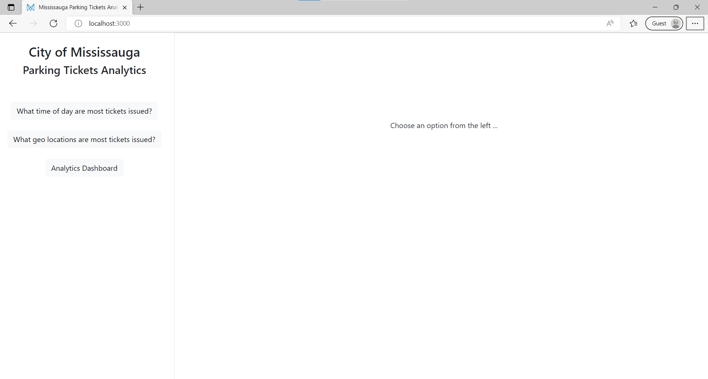
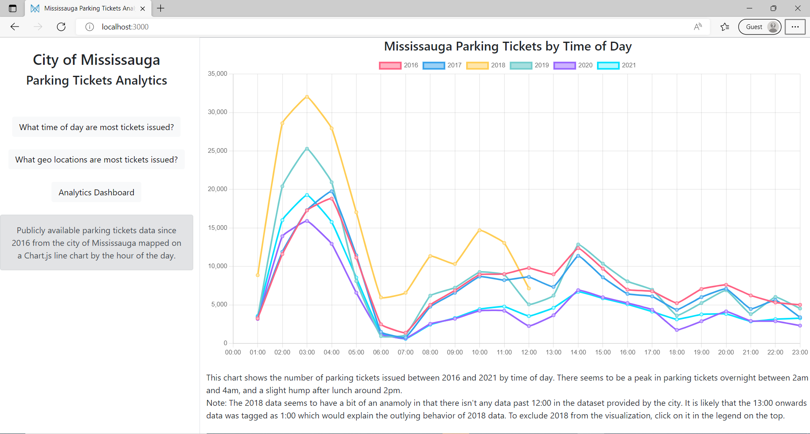
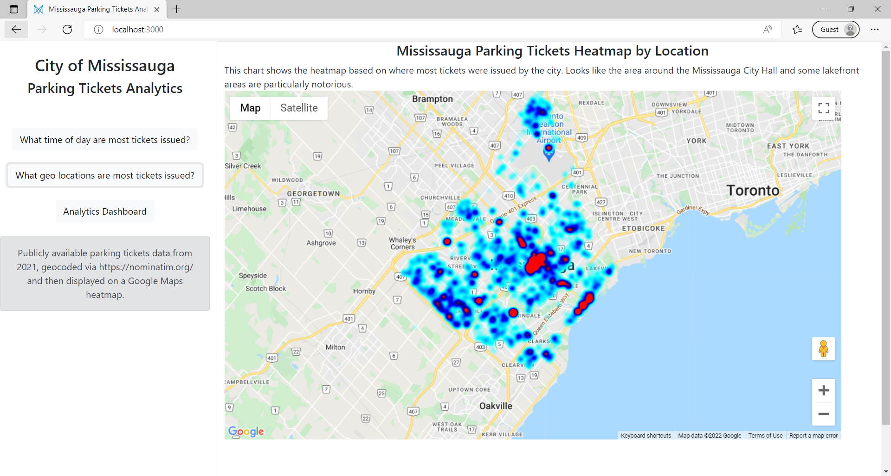

# City of Mississauga Parking Tickets Analytics
This is a ReactJS project that uses publicly available data from City of Mississauga to build a few different insight pages. It uses [Chart.JS](https://www.chartjs.org/), [Google Maps](https://www.google.com/maps) , [Heatmaps](https://developers.google.com/maps/documentation/javascript/heatmaplayer), [Bootstrap](https://react-bootstrap.github.io/), Axios and [Papa Parse](https://www.papaparse.com/) to name a few of the libraries. This site only uses built in React state and does not rely on Redux or other state stores. 

## Navigation
The site uses the left one fourth of the bootstrap grid for navigation, and the remaining for content. When you initially launch the site you are greeted by a simplistic navigation on the left and a simple message on the right asking the user to choose an action. 



## Tickets by Time of Day
If the user clicks on the first link, a small alert appears underneath the navigation area with some overview information; and TicketsByTimeOfDay component is loaded in the content area. The first time this link is loaded, you may momentarily (1-2 seconds) see a "Loading" message as it reads the ParkingTickets data files, strips the time of day the ticket was issued from all the data files (2016-2021) and aggregates them. It then displays a line chart visualization that uses chart.js to show the number of tickets issued, and plots them against the time of day on the x-axis. 



The chart is fully interactive and you can click on the years in the header to animatedly remove data from the chart. 


## Tickets by Location Google Maps HeatMap
If the user clicks on the second link, a small alert appears underneath the navigtion area with some overview information; and TicketsByLocationHeatMap component is loaded in the content area. This component is centred on Mississauga, and shows a heat map of the locations where most number of tickets were issued based on the 2021 data. Obviously it is a fully functional Google Maps control and the user can zoom in to investigate areas upclose. 



## How were street addresses converted to geo co-ordinates
Geocoding is the process of converting street address to lat and long co-ordinates. There are a number of services including Google, OpenStreetMaps, etc. that offer this service via their respective API but they can get expensive. Google charges about $4 for 1000 queries, and we have about 180,000 records in a single year's data. A total of 6 years of data would roughly cost around $4,000. For demo purposes, I took only 2021 data and ran it through an open source and free service called Nominatim (https://nominatim.org/). Nominatim allows you to geocode your street addresses free of cost, but they do have some limitations particularly around throughput. It only allows one request per second, and repeated requests of the same address can be blocked. I wrote a quick utility that you can find under helper/Geocoder.js that uses Axios to fetch geocoded data for a subset of street addresses, one per second, and then saves it in another file. I then used this file in my HeatMap sample. 

One last thing of note is that because I was working with a fairly small geocoded data set, I pass it in as inidivual points to create the heat map. If I were doing this for production, it is better to consolidate points from the same lat and long and pass them with a higher weight to get better performance. This way instead of Google Map having to render a 1000 individual points, will only render one point with a higher weight thus saving processing.  

## Analytics Dashboard

If the user clicks on the final Analytics Dashboard link, the user is presented with a sophisticated dashboard showcasing various chart.js visualizations. This dashboard uses mock data and isn't tied to actual data from the city as the purpose was to showcase react, bootstrap and chart.js integration. Again all of the visualizations are fully interactive as shown below. 


## React Component Hierarchy
Index.js loads a single Layout.js component. 
Layout.js uses bootstrap to setup 3 column wide left nav (LeftNav.js), and 9 column wide content area. Depending on what option is clicked, layout.js loads appropriate components in the content area. These are one of TicketsByTimeOfDay.js, TicketsByLocationHeatMapContainer.js, or Dashboard.js. 
Dashboard.js loads bunch of other Dashboard sub components e.g. DashboardInfo, DashboardLineChart, DashboardBubbleChart, etc. 

## How To Use

To clone and run this application, you'll need [Git](https://git-scm.com) and [Node.js](https://nodejs.org/en/download/) (which comes with [npm](http://npmjs.com)) installed on your computer. From your command line:

```bash
# Clone this repository
$ git clone https://github.com/asadikhan/mississaugaparkingtickets

# Go into the repository
$ cd mississaugaparkingtickets

# Install dependencies
$ npm install

# Run the app
$ npm start
```

In order for the Google HeatMap to appear, you need to create a [Google Maps API Key](https://developers.google.com/maps/documentation/javascript/get-api-key) and update the apiKey in the LocationHeatMap.js as shown below. 

```
export default GoogleApiWrapper({
  apiKey: "INSERT-YOUR-API-KEY-HERE",
  libraries: ["visualization"]
})(LocationHeatMap);
```

## Credits

- The Parking Tickets data used in this project is publicly available from City of Mississauga at https://data.mississauga.ca/search?collection=Dataset&q=Transportation